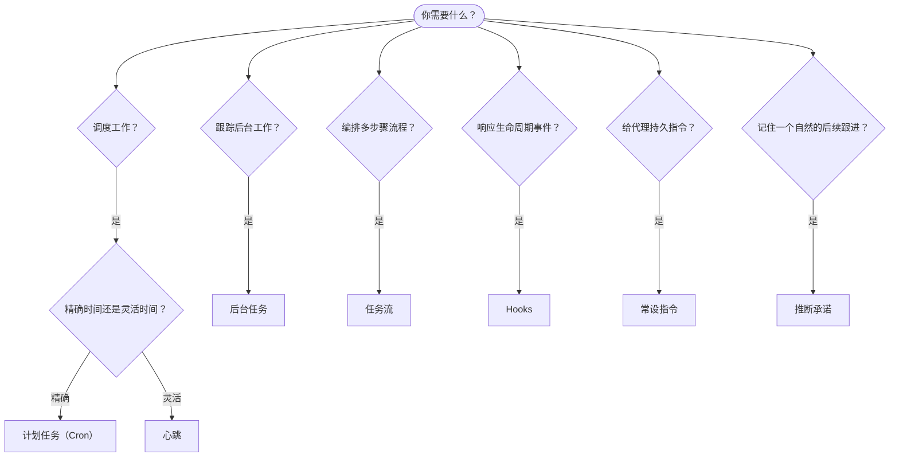

OpenClaw 通过任务、计划任务、推断承诺、事件 hooks 和常设指令在后台运行工作。本页帮助你选择合适的机制，并了解它们之间的关系。

## 快速决策指南

| 使用场景                    | 推荐方案         | 原因                                            |
| --------------------------- | ---------------- | ----------------------------------------------- |
| 每天上午 9 点准时发送报告   | 计划任务（Cron） | 精确计时，隔离执行                              |
| 20 分钟后提醒我             | 计划任务（Cron） | 一次性且时间精确（`--at`）                      |
| 每周进行深度分析            | 计划任务（Cron） | 独立任务，可使用不同模型                        |
| 每 30 分钟检查收件箱        | 心跳             | 与其他检查批量处理，感知上下文                  |
| 监控日历中的即将到来的事件  | 心跳             | 天然适合定期感知                                |
| 在提到的面试后跟进          | 推断承诺         | 类似记忆的跟进，无需精确提醒请求                |
| 在用户上下文后温和关怀      | 推断承诺         | 限定于同一代理和频道                            |
| 检查子代理或 ACP 运行的状态 | 后台任务         | 任务账本跟踪所有后台工作                        |
| 审计运行内容和时间          | 后台任务         | `openclaw tasks list` 和 `openclaw tasks audit` |
| 多步研究后汇总              | 任务流           | 带修订跟踪的持久编排                            |
| 会话重置时运行脚本          | Hooks            | 事件驱动，在生命周期事件时触发                  |
| 每次工具调用时执行代码      | 插件 hooks       | 进程内 hooks 可拦截工具调用                     |
| 每次回复前始终检查合规性    | 常设指令         | 自动注入到每个会话                              |

### 计划任务（Cron）vs 心跳

| 维度       | 计划任务（Cron）            | 心跳                   |
| ---------- | --------------------------- | ---------------------- |
| 计时       | 精确（cron 表达式、一次性） | 大约（默认每 30 分钟） |
| 会话上下文 | 全新（隔离）或共享          | 完整的主会话上下文     |
| 任务记录   | 始终创建                    | 从不创建               |
| 投递       | 频道、Webhook 或静默        | 内联在主会话中         |
| 最适合     | 报告、提醒、后台任务        | 收件箱检查、日历、通知 |

当需要精确计时或隔离执行时使用计划任务（Cron）。当工作受益于完整会话上下文且大致计时即可时使用心跳。

## 核心概念

### 计划任务（cron）

Cron 是 Gateway 内置的精确计时调度器。它持久化任务、在合适时间唤醒代理，并可将输出投递到聊天频道或 Webhook 端点。支持一次性提醒、周期性表达式和入站 Webhook 触发。

参见[计划任务](/automation/cron-jobs)。

### 任务

后台任务账本跟踪所有后台工作：ACP 运行、子代理生成、隔离 cron 执行和 CLI 操作。任务是记录，而非调度器。使用 `openclaw tasks list` 和 `openclaw tasks audit` 来检查它们。

参见[后台任务](/automation/tasks)。

### 推断承诺

承诺是可选的、短期的跟进记忆。OpenClaw 从正常对话中推断它们，将其限定于同一代理和频道，并通过心跳投递到期的跟进。用户明确请求的精确提醒仍属于 cron 的范畴。

参见[推断承诺](/concepts/commitments)。

### 任务流

任务流是位于后台任务之上的流编排基础设施。它管理具有托管和镜像同步模式的持久多步骤流，支持修订跟踪，并提供 `openclaw tasks flow list|show|cancel` 用于检查。

参见[任务流](/automation/taskflow)。

### 常设指令

常设指令为代理授予针对特定程序的永久操作权限。它们存储在工作区文件（通常为 `AGENTS.md`）中，并注入到每个会话。可结合 cron 实现基于时间的执行。

参见[常设指令](/automation/standing-orders)。

### Hooks

内部 hooks 是由代理生命周期事件（`/new`、`/reset`、`/stop`）、会话压缩、gateway 启动和消息流触发的事件驱动脚本。它们自动从目录中发现，可用 `openclaw hooks` 管理。对于进程内工具调用拦截，请使用[插件 hooks](/plugins/hooks)。

参见 [Hooks](/automation/hooks)。

### 心跳

心跳是周期性的主会话轮次（默认每 30 分钟）。它在一个代理轮次中批量处理多项检查（收件箱、日历、通知），具备完整会话上下文。心跳轮次不创建任务记录，也不延长每日/空闲会话重置新鲜度。使用 `HEARTBEAT.md` 提供小型清单，或在心跳内部使用 `tasks:` 块进行仅在到期时执行的定期检查。空的心跳文件跳过并标记为 `empty-heartbeat-file`；仅到期任务模式在无到期任务时跳过并标记为 `no-tasks-due`。当 cron 工作处于活跃或排队状态时心跳会推迟，`heartbeat.skipWhenBusy` 还可在子代理或嵌套通道繁忙时推迟心跳。

参见[心跳](/gateway/heartbeat)。

## 协同工作原理

- **Cron** 处理精确调度（每日报告、每周回顾）和一次性提醒。所有 cron 执行均创建任务记录。
- **心跳** 每 30 分钟在一个批次轮次中处理例行监控（收件箱、日历、通知）。
- **Hooks** 通过自定义脚本响应特定事件（会话重置、压缩、消息流）。插件 hooks 涵盖工具调用。
- **常设指令** 为代理提供持久上下文和权限边界。
- **任务流** 在各个任务之上协调多步骤流程。
- **任务** 自动跟踪所有后台工作，方便检查和审计。

## 相关文档

- [计划任务](/automation/cron-jobs) — 精确调度和一次性提醒
- [推断承诺](/concepts/commitments) — 类似记忆的跟进检查
- [后台任务](/automation/tasks) — 所有后台工作的任务账本
- [任务流](/automation/taskflow) — 持久多步骤流编排
- [Hooks](/automation/hooks) — 事件驱动生命周期脚本
- [插件 hooks](/plugins/hooks) — 进程内工具、提示词、消息和生命周期 hooks
- [常设指令](/automation/standing-orders) — 持久代理指令
- [心跳](/gateway/heartbeat) — 周期性主会话轮次
- [配置参考](/gateway/configuration-reference) — 所有配置键
