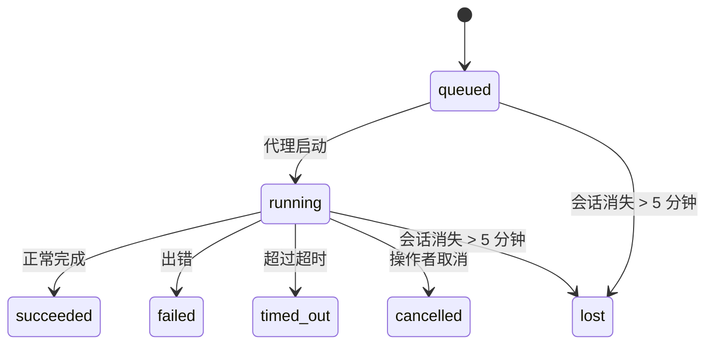

<Note>
寻找调度功能？请参阅[自动化与任务](/automation)选择合适的机制。本页是后台工作的活动账本，而非调度器。
</Note>

后台任务跟踪在**主对话会话之外**运行的工作：ACP 运行、子代理生成、隔离 cron 任务执行和 CLI 发起的操作。

任务**不会**替代会话、定时任务或心跳——它们是记录后台工作发生时间、内容及是否成功的**活动账本**。

<Note>
并非每次代理运行都会创建任务。心跳轮次和正常的交互式聊天不会创建。所有 cron 执行、ACP 生成、子代理生成和 CLI 代理命令都会创建。
</Note>

## 速览

- 任务是**记录**，而非调度器——cron 和心跳决定*何时*运行，任务跟踪*发生了什么*。
- ACP、子代理、所有 cron 任务和 CLI 操作会创建任务。心跳轮次不会。
- 每个任务经历 `queued → running → terminal`（succeeded、failed、timed_out、cancelled 或 lost）。
- Cron 任务在 cron 运行时仍将该任务标记为运行中时保持存活；若内存中的运行时状态已消失，任务维护会先检查持久化的 cron 运行历史，再将任务标记为 lost。
- 完成是推送驱动的：后台工作完成后可直接通知或唤醒请求者会话/心跳，因此状态轮询循环通常不是正确的方式。
- 隔离 cron 运行和子代理完成在最终清理记账之前，会尽力关闭其子会话中跟踪的浏览器标签/进程。
- 隔离 cron 投递在后代子代理工作仍在排空时抑制过期的父级临时回复，并在最终后代输出到达前优先使用该输出。
- 完成通知直接投递到频道或排队等待下次心跳。
- `openclaw tasks list` 显示所有任务；`openclaw tasks audit` 显示问题。
- 终止记录保留 7 天后自动清理。

## 快速开始

<Tabs>
  <Tab title="列出和过滤">
    ```bash
    # 列出所有任务（最新优先）
    openclaw tasks list

    # 按运行时或状态过滤
    openclaw tasks list --runtime acp
    openclaw tasks list --status running
    ```

  </Tab>
  <Tab title="检查">
    ```bash
    # 按 ID、运行 ID 或会话键显示特定任务的详情
    openclaw tasks show <lookup>
    ```
  </Tab>
  <Tab title="取消和通知">
    ```bash
    # 取消运行中的任务（关闭子会话）
    openclaw tasks cancel <lookup>

    # 更改任务的通知策略
    openclaw tasks notify <lookup> state_changes
    ```

  </Tab>
  <Tab title="审计和维护">
    ```bash
    # 运行健康审计
    openclaw tasks audit

    # 预览或应用维护
    openclaw tasks maintenance
    openclaw tasks maintenance --apply
    ```

  </Tab>
  <Tab title="任务流">
    ```bash
    # 检查任务流状态
    openclaw tasks flow list
    openclaw tasks flow show <lookup>
    openclaw tasks flow cancel <lookup>
    ```
  </Tab>
</Tabs>

## 哪些操作创建任务

| 来源                 | 运行时类型 | 创建任务记录的时机                                | 默认通知策略 |
| -------------------- | ---------- | ------------------------------------------------- | ------------ |
| ACP 后台运行         | `acp`      | 生成子 ACP 会话时                                 | `done_only`  |
| 子代理编排           | `subagent` | 通过 `sessions_spawn` 生成子代理时                | `done_only`  |
| 定时任务（所有类型） | `cron`     | 每次 cron 执行（主会话和隔离）                    | `silent`     |
| CLI 操作             | `cli`      | 通过 gateway 运行的 `openclaw agent` 命令         | `silent`     |
| 代理媒体任务         | `cli`      | 会话支持的 `music_generate`/`video_generate` 运行 | `silent`     |

<AccordionGroup>
  <Accordion title="cron 和媒体的通知默认值">
    主会话 cron 任务默认使用 `silent` 通知策略——它们创建记录用于跟踪，但不生成通知。隔离 cron 任务也默认为 `silent`，但由于它们在自己的会话中运行，可见性更高。

    会话支持的 `music_generate` 和 `video_generate` 运行同样使用 `silent` 通知策略。它们仍会创建任务记录，但完成后会以内部唤醒的方式返回原始代理会话，代理可自行撰写跟进消息并附上完成的媒体。若选择启用 `tools.media.asyncCompletion.directSend`，异步 `video_generate` 完成可先尝试直接频道投递；异步 `music_generate` 完成仍走请求者会话唤醒路径。

  </Accordion>
  <Accordion title="并发 video_generate 保护">
    当会话支持的 `video_generate` 任务仍处于活跃状态时，该工具会作为保护机制：在同一会话中重复调用 `video_generate` 将返回活跃任务状态，而不是启动第二个并发生成。若需要从代理侧显式查询进度/状态，请使用 `action: "status"`。
  </Accordion>
  <Accordion title="不创建任务的操作">
    - 心跳轮次 — 主会话；参见[心跳](/gateway/heartbeat)
    - 正常的交互式聊天轮次
    - 直接 `/command` 响应

  </Accordion>
</AccordionGroup>

## 任务生命周期



| 状态        | 含义                                      |
| ----------- | ----------------------------------------- |
| `queued`    | 已创建，等待代理启动                      |
| `running`   | 代理轮次正在执行                          |
| `succeeded` | 成功完成                                  |
| `failed`    | 带错误完成                                |
| `timed_out` | 超过配置的超时时间                        |
| `cancelled` | 被操作者通过 `openclaw tasks cancel` 停止 |
| `lost`      | 5 分钟宽限期后运行时失去权威性支撑状态    |

状态转换自动发生——当关联的代理运行结束时，任务状态自动更新。

代理运行完成对活跃任务记录具有权威性。成功的后台运行最终为 `succeeded`，普通运行错误最终为 `failed`，超时或中止结果最终为 `timed_out`。若操作者已取消任务，或运行时已记录了更强的终止状态（如 `failed`、`timed_out` 或 `lost`），后续的成功信号不会降级该终止状态。

`lost` 感知运行时：

- ACP 任务：支撑的 ACP 子会话元数据消失。
- 子代理任务：支撑的子会话从目标代理存储中消失。
- Cron 任务：cron 运行时不再将该任务标记为活跃，且持久化 cron 运行历史中也没有该运行的终止结果。离线 CLI 审计不会将自身进程内的 cron 运行时状态为空视为权威证明。
- CLI 任务：隔离子会话任务使用子会话；聊天支持的 CLI 任务使用实时运行上下文，因此残留的频道/分组/直接会话行不会使其保持存活。Gateway 支持的 `openclaw agent` 运行同样从其运行结果完结，不会等到清扫器将其标记为 `lost` 后才结束活跃状态。

## 投递与通知

当任务达到终止状态时，OpenClaw 会通知你。有两条投递路径：

**直接投递** — 若任务有频道目标（`requesterOrigin`），完成消息直接发送到该频道（Telegram、Discord、Slack 等）。对于子代理完成，OpenClaw 还会在可用时保留绑定的线程/话题路由，并可在放弃直接投递之前从请求者会话存储的路由（`lastChannel` / `lastTo` / `lastAccountId`）中填充缺失的 `to` / 账户。

**会话排队投递** — 若直接投递失败或未设置来源，更新会作为系统事件排入请求者会话，并在下次心跳时显示。

<Tip>
任务完成会触发即时心跳唤醒，让你快速看到结果——无需等待下次计划的心跳滴答。
</Tip>

这意味着通常的工作流是推送驱动的：启动后台工作一次，然后让运行时在完成时唤醒或通知你。只有在需要调试、干预或明确审计时才轮询任务状态。

### 通知策略

控制每个任务的通知量：

| 策略                | 投递内容                                           |
| ------------------- | -------------------------------------------------- |
| `done_only`（默认） | 仅终止状态（succeeded、failed 等）——**这是默认值** |
| `state_changes`     | 每次状态转换和进度更新                             |
| `silent`            | 完全不通知                                         |

在任务运行时更改策略：

```bash
openclaw tasks notify <lookup> state_changes
```

## CLI 参考

<AccordionGroup>
  <Accordion title="tasks list">
    ```bash
    openclaw tasks list [--runtime <acp|subagent|cron|cli>] [--status <status>] [--json]
    ```

    输出列：任务 ID、类型、状态、投递、运行 ID、子会话、摘要。

  </Accordion>
  <Accordion title="tasks show">
    ```bash
    openclaw tasks show <lookup>
    ```

    查找 token 接受任务 ID、运行 ID 或会话键。显示完整记录，包括时间、投递状态、错误和终止摘要。

  </Accordion>
  <Accordion title="tasks cancel">
    ```bash
    openclaw tasks cancel <lookup>
    ```

    对于 ACP 和子代理任务，这会关闭子会话。对于 CLI 跟踪的任务，取消操作记录在任务注册表中（没有单独的子运行时句柄）。状态转换为 `cancelled`，并在适用时发送投递通知。

  </Accordion>
  <Accordion title="tasks notify">
    ```bash
    openclaw tasks notify <lookup> <done_only|state_changes|silent>
    ```
  </Accordion>
  <Accordion title="tasks audit">
    ```bash
    openclaw tasks audit [--json]
    ```

    显示操作问题。当检测到问题时，发现结果也会出现在 `openclaw status` 中。

    | 发现项                    | 严重程度   | 触发条件                                                                                                      |
    | ------------------------- | ---------- | ------------------------------------------------------------------------------------------------------------ |
    | `stale_queued`            | warn       | 排队超过 10 分钟                                                                                             |
    | `stale_running`           | error      | 运行超过 30 分钟                                                                                             |
    | `lost`                    | warn/error | 运行时支撑的任务所有权消失；保留的 lost 任务在 `cleanupAfter` 之前警告，之后变为错误                        |
    | `delivery_failed`         | warn       | 投递失败且通知策略不是 `silent`                                                                              |
    | `missing_cleanup`         | warn       | 终止任务无清理时间戳                                                                                         |
    | `inconsistent_timestamps` | warn       | 时间线违规（例如结束时间早于开始时间）                                                                       |

  </Accordion>
  <Accordion title="tasks maintenance">
    ```bash
    openclaw tasks maintenance [--json]
    openclaw tasks maintenance --apply [--json]
    ```

    用于预览或应用任务及任务流状态的对账、清理标记和修剪。

    对账感知运行时：

    - ACP/子代理任务检查其支撑的子会话。
    - 子代理任务若其子会话有重启恢复墓碑，则标记为 lost，而不视为可恢复的支撑会话。
    - Cron 任务检查 cron 运行时是否仍持有该任务，然后从持久化的 cron 运行日志/任务状态中恢复终止状态，最后回退到 `lost`。只有 Gateway 进程对内存中的 cron 活跃任务集具有权威性；离线 CLI 审计使用持久化历史，但不会仅因本地 Set 为空就将 cron 任务标记为 lost。
    - 聊天支持的 CLI 任务检查拥有的实时运行上下文，而不仅仅是聊天会话行。

    完成清理同样感知运行时：

    - 子代理完成在公告清理继续之前，尽力关闭子会话中跟踪的浏览器标签/进程。
    - 隔离 cron 完成在运行完全拆卸之前，尽力关闭 cron 会话中跟踪的浏览器标签/进程。
    - 隔离 cron 投递在需要时等待后代子代理跟进，并抑制过期的父级确认文本而不是公告它。
    - 子代理完成投递优先使用最新可见的助手文本；若为空则回退到经过清理的最新工具/工具结果文本，且仅有超时工具调用的运行可以折叠为简短的部分进度摘要。终止失败的运行在公告失败状态时不重放捕获的回复文本。
    - 清理失败不会掩盖真实的任务结果。

  </Accordion>
  <Accordion title="tasks flow list | show | cancel">
    ```bash
    openclaw tasks flow list [--status <status>] [--json]
    openclaw tasks flow show <lookup> [--json]
    openclaw tasks flow cancel <lookup>
    ```

    当你关注的是编排任务流而非单个后台任务记录时，使用这些命令。

  </Accordion>
</AccordionGroup>

## 聊天任务看板（`/tasks`）

在任意聊天会话中使用 `/tasks` 可查看与该会话关联的后台任务。看板显示活跃和最近完成的任务，包括运行时、状态、时间及进度或错误详情。

当当前会话没有可见的关联任务时，`/tasks` 会回退到代理本地任务计数，让你无需泄漏其他会话详情即可获得概览。

如需完整的操作员账本，请使用 CLI：`openclaw tasks list`。

## 状态集成（任务压力）

`openclaw status` 包含任务摘要一览：

```
Tasks: 3 queued · 2 running · 1 issues
```

摘要报告：

- **active** — `queued` + `running` 的数量
- **failures** — `failed` + `timed_out` + `lost` 的数量
- **byRuntime** — 按 `acp`、`subagent`、`cron`、`cli` 细分

`/status` 和 `session_status` 工具均使用感知清理的任务快照：活跃任务优先，过期的已完成行被隐藏，且近期失败只在没有活跃工作时显示。这使状态卡专注于当前最重要的事项。

## 存储与维护

### 任务存储位置

任务记录持久化在以下位置的 SQLite 中：

```
$OPENCLAW_STATE_DIR/tasks/runs.sqlite
```

注册表在 gateway 启动时加载到内存中，并将写入同步到 SQLite 以保证重启后的持久性。
Gateway 通过使用 SQLite 默认自动检查点阈值加上定期和关闭时的 `TRUNCATE` 检查点来控制 SQLite 预写日志的大小。

### 自动维护

清扫器每 **60 秒**运行一次，处理四件事：

<Steps>
  <Step title="对账">
    检查活跃任务是否仍有权威性运行时支撑。ACP/子代理任务使用子会话状态，cron 任务使用活跃任务所有权，聊天支持的 CLI 任务使用拥有的运行上下文。若该支撑状态消失超过 5 分钟，任务标记为 `lost`。
  </Step>
  <Step title="ACP 会话修复">
    关闭终止或孤立的父级拥有的一次性 ACP 会话，以及在没有活跃对话绑定时关闭终止或孤立的持久 ACP 会话。
  </Step>
  <Step title="清理标记">
    为终止任务设置 `cleanupAfter` 时间戳（endedAt + 7 天）。在保留期内，lost 任务仍以警告出现在审计中；`cleanupAfter` 过期或清理元数据缺失后，它们变为错误。
  </Step>
  <Step title="修剪">
    删除已超过 `cleanupAfter` 日期的记录。
  </Step>
</Steps>

<Note>
**保留期：** 终止任务记录保留 **7 天**后自动清理。无需配置。
</Note>

## 任务与其他系统的关系

<AccordionGroup>
  <Accordion title="任务与任务流">
    [任务流](/automation/taskflow)是位于后台任务之上的流编排层。单个流在其生命周期内可使用托管或镜像同步模式协调多个任务。使用 `openclaw tasks` 检查单个任务记录，使用 `openclaw tasks flow` 检查编排流。

    详见[任务流](/automation/taskflow)。

  </Accordion>
  <Accordion title="任务与定时任务">
    定时任务**定义**存储在 `~/.openclaw/cron/jobs.json` 中；运行时执行状态存储在同目录的 `~/.openclaw/cron/jobs-state.json` 中。**每次** cron 执行都会创建任务记录——包括主会话和隔离运行。主会话 cron 任务默认使用 `silent` 通知策略，以便在不产生通知的情况下进行跟踪。

    参见[定时任务](/automation/cron-jobs)。

  </Accordion>
  <Accordion title="任务与心跳">
    心跳运行是主会话轮次——不创建任务记录。当任务完成时，可以触发心跳唤醒，让你快速看到结果。

    参见[心跳](/gateway/heartbeat)。

  </Accordion>
  <Accordion title="任务与会话">
    任务可能引用 `childSessionKey`（工作运行的地方）和 `requesterSessionKey`（启动者）。会话是对话上下文；任务是在此之上的活动跟踪。
  </Accordion>
  <Accordion title="任务与代理运行">
    任务的 `runId` 链接到执行工作的代理运行。代理生命周期事件（启动、结束、错误）自动更新任务状态——无需手动管理生命周期。
  </Accordion>
</AccordionGroup>

## 相关文档

- [自动化与任务](/automation) — 所有自动化机制概览
- [CLI：Tasks](/cli/tasks) — CLI 命令参考
- [心跳](/gateway/heartbeat) — 周期性主会话轮次
- [计划任务](/automation/cron-jobs) — 调度后台工作
- [任务流](/automation/taskflow) — 任务之上的流编排
