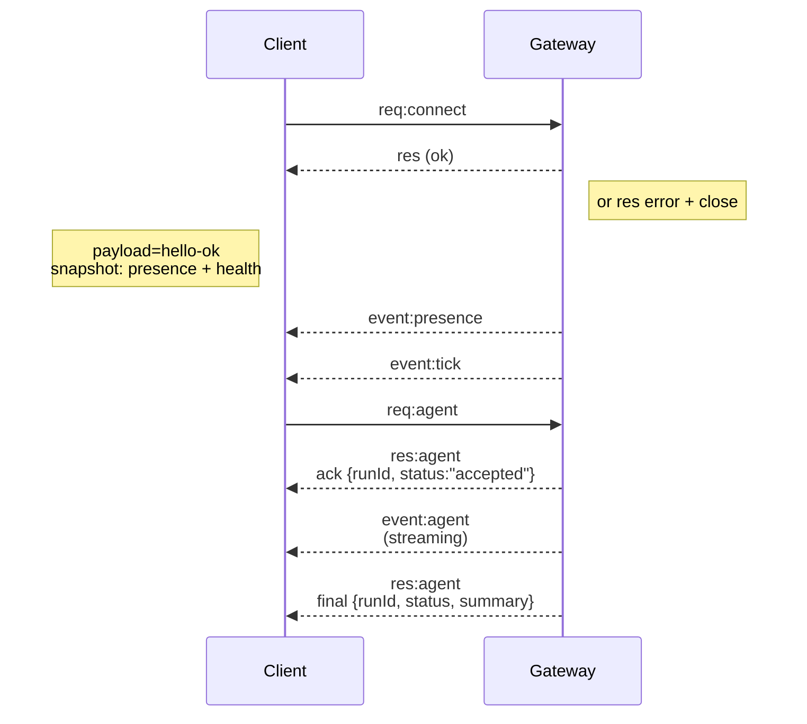

## 概述

- 一个长期运行的**网关**拥有所有消息接口（WhatsApp via Baileys、Telegram via grammY、Slack、Discord、Signal、iMessage、WebChat）。
- 控制平面客户端（macOS 应用、CLI、Web UI、自动化）通过配置的绑定主机（默认 `127.0.0.1:18789`）上的 **WebSocket** 连接到网关。
- **节点**（macOS/iOS/Android/无头）也通过 **WebSocket** 连接，但声明 `role: node` 并带有显式的能力/命令。
- 每台主机一个网关；它是唯一打开 WhatsApp 会话的地方。
- **canvas 主机**由网关 HTTP 服务器提供服务，位于：
  - `/__openclaw__/canvas/`（智能体可编辑的 HTML/CSS/JS）
  - `/__openclaw__/a2ui/`（A2UI 主机）
    它使用与网关相同的端口（默认 `18789`）。

## 组件和流程

### 网关（守护进程）

- 维护提供商连接。
- 公开类型化的 WS API（请求、响应、服务器推送事件）。
- 根据 JSON Schema 验证入站帧。
- 发出 `agent`、`chat`、`presence`、`health`、`heartbeat`、`cron` 等事件。

### 客户端（mac 应用 / CLI / Web 管理端）

- 每个客户端一个 WS 连接。
- 发送请求（`health`、`status`、`send`、`agent`、`system-presence`）。
- 订阅事件（`tick`、`agent`、`presence`、`shutdown`）。

### 节点（macOS / iOS / Android / 无头）

- 以 `role: node` 连接到**同一 WS 服务器**。
- 在 `connect` 中提供设备身份；配对是**基于设备的**（角色 `node`），审批保存在设备配对存储中。
- 公开 `canvas.*`、`camera.*`、`screen.record`、`location.get` 等命令。

协议详情：

- [网关协议](/gateway/protocol)

### WebChat

- 静态 UI，使用网关 WS API 进行聊天历史记录和发送。
- 在远程设置中，通过与其他客户端相同的 SSH/Tailscale 隧道连接。

## 连接生命周期（单客户端）



## 有线协议（摘要）

- 传输：WebSocket，带 JSON 有效载荷的文本帧。
- 第一帧**必须**是 `connect`。
- 握手后：
  - 请求：`{type:"req", id, method, params}` → `{type:"res", id, ok, payload|error}`
  - 事件：`{type:"event", event, payload, seq?, stateVersion?}`
- `hello-ok.features.methods` / `events` 是发现元数据，不是每个可调用辅助路由的生成转储。
- 共享密钥认证使用 `connect.params.auth.token` 或 `connect.params.auth.password`，取决于配置的网关认证模式。
- 像 Tailscale Serve（`gateway.auth.allowTailscale: true`）或非环回 `gateway.auth.mode: "trusted-proxy"` 这样的身份携带模式从请求头满足认证，而不是 `connect.params.auth.*`。
- 私有入口 `gateway.auth.mode: "none"` 完全禁用共享密钥认证；在公共/不受信任的入口上保持该模式关闭。
- 具有副作用的方法（`send`、`agent`）需要幂等键以安全重试；服务器保留短暂的去重缓存。
- 节点必须在 `connect` 中包含 `role: "node"` 加上 caps/commands/permissions。

## 配对 + 本地信任

- 所有 WS 客户端（操作者 + 节点）在 `connect` 上包含**设备身份**。
- 新设备 ID 需要配对审批；网关为后续连接颁发**设备令牌**。
- 直接本地环回连接可以自动审批，以保持同主机用户体验顺畅。
- OpenClaw 还有一个用于可信共享密钥辅助流的窄后端/容器本地自连接路径。
- Tailnet 和 LAN 连接，包括同主机 tailnet 绑定，仍然需要显式配对审批。
- 所有连接必须对 `connect.challenge` nonce 进行签名。
- 签名有效载荷 `v3` 还绑定 `platform` + `deviceFamily`；网关在重新连接时固定配对元数据，并要求元数据更改时重新配对。
- **非本地**连接仍然需要显式审批。
- 网关认证（`gateway.auth.*`）仍然适用于**所有**连接，无论本地还是远程。

详情：[网关协议](/gateway/protocol)、[配对](/channels/pairing)、[安全](/gateway/security)。

## 协议类型和代码生成

- TypeBox 模式定义协议。
- 从这些模式生成 JSON Schema。
- 从 JSON Schema 生成 Swift 模型。

## 远程访问

- 首选：Tailscale 或 VPN。
- 替代方案：SSH 隧道

  ```bash
  ssh -N -L 18789:127.0.0.1:18789 user@host
  ```

- 相同的握手 + 认证令牌适用于隧道。
- 可以为远程设置中的 WS 启用 TLS + 可选固定。

## 运维快照

- 启动：`openclaw gateway`（前台，日志输出到 stdout）。
- 健康检查：通过 WS 的 `health`（也包含在 `hello-ok` 中）。
- 监控：launchd/systemd 用于自动重启。

## 不变量

- 恰好一个网关控制每台主机上的单个 Baileys 会话。
- 握手是强制的；任何非 JSON 或非 connect 的第一帧都会导致硬关闭。
- 事件不会重放；客户端必须在间隙时刷新。

## 相关

- [智能体循环](/concepts/agent-loop) — 详细的智能体执行周期
- [网关协议](/gateway/protocol) — WebSocket 协议合同
- [队列](/concepts/queue) — 命令队列和并发
- [安全](/gateway/security) — 信任模型和加固
