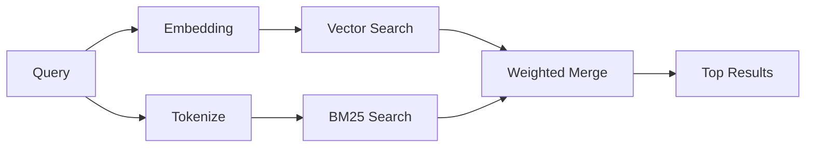

`memory_search` 从记忆文件中找到相关笔记，即使措辞与原文不同。它通过将记忆索引为小块并使用嵌入、关键字或两者搜索来工作。

## 快速入门

如果你配置了 GitHub Copilot 订阅、OpenAI、Gemini、Voyage 或 Mistral API 密钥，记忆搜索会自动工作。要显式设置提供商：

```json5
{
  agents: {
    defaults: {
      memorySearch: {
        provider: "openai", // 或 "gemini", "local", "ollama" 等
      },
    },
  },
}
```

对于多端点设置，`provider` 也可以是自定义的 `models.providers.<id>` 条目，如 `ollama-5080`，当该提供商设置 `api: "ollama"` 或其他嵌入适配器所有者时。

对于无 API 密钥的本地嵌入，设置 `provider: "local"`。源代码检出可能仍需要本机构建批准：`pnpm approve-builds` 然后 `pnpm rebuild node-llama-cpp`。

某些 OpenAI 兼容的嵌入端点需要非对称标签，例如搜索时 `input_type: "query"`，索引块时 `input_type: "document"` 或 `"passage"`。使用 `memorySearch.queryInputType` 和 `memorySearch.documentInputType` 配置这些；参见[记忆配置参考](/reference/memory-config#provider-specific-config)。

## 支持的提供商

| 提供商         | ID               | 需要 API 密钥 | 说明                        |
| -------------- | ---------------- | ------------- | --------------------------- |
| Bedrock        | `bedrock`        | 否            | 当 AWS 凭证链解析时自动检测 |
| Gemini         | `gemini`         | 是            | 支持图像/音频索引           |
| GitHub Copilot | `github-copilot` | 否            | 自动检测，使用 Copilot 订阅 |
| Local          | `local`          | 否            | GGUF 模型，约 0.6 GB 下载   |
| Mistral        | `mistral`        | 是            | 自动检测                    |
| Ollama         | `ollama`         | 否            | 本地，必须显式设置          |
| OpenAI         | `openai`         | 是            | 自动检测，速度快            |
| Voyage         | `voyage`         | 是            | 自动检测                    |

## 搜索工作原理

OpenClaw 并行运行两条检索路径并合并结果：



- **向量搜索**查找含义相似的笔记（"gateway host" 匹配 "the machine running OpenClaw"）。
- **BM25 关键字搜索**查找精确匹配（ID、错误字符串、配置键）。

如果只有一条路径可用（无嵌入或无 FTS），则单独运行另一条。

当嵌入不可用时，OpenClaw 仍然对 FTS 结果使用词法排名，而不仅仅回退到原始精确匹配排序。这种降级模式提升了具有更强查询词覆盖和相关文件路径的块的排名，即使没有 `sqlite-vec` 或嵌入提供商，召回也保持有用。

## 提升搜索质量

当你有大量笔记历史时，两个可选功能有所帮助：

### 时间衰减

旧笔记逐渐失去排名权重，使最近信息优先出现。默认半衰期为 30 天，上个月的笔记得分为原始权重的 50%。像 `MEMORY.md` 这样的常青文件永不衰减。

<Tip>
如果你的智能体有几个月的每日笔记，而陈旧信息不断胜过最近的上下文，请启用时间衰减。
</Tip>

### MMR（多样性）

减少冗余结果。如果五条笔记都提到同一个路由器配置，MMR 确保最顶部结果涵盖不同主题，而不是重复。

<Tip>
如果 `memory_search` 一直从不同的每日笔记中返回几乎重复的片段，请启用 MMR。
</Tip>

### 同时启用两者

```json5
{
  agents: {
    defaults: {
      memorySearch: {
        query: {
          hybrid: {
            mmr: { enabled: true },
            temporalDecay: { enabled: true },
          },
        },
      },
    },
  },
}
```

## 多模态记忆

使用 Gemini Embedding 2，你可以将图像和音频文件与 Markdown 一起索引。搜索查询保持为文本，但它们与视觉和音频内容匹配。有关设置，参见[记忆配置参考](/reference/memory-config)。

## 会话记忆搜索

你可以选择性地索引会话记录，使 `memory_search` 能够召回早期对话。这通过 `memorySearch.experimental.sessionMemory` 选择加入。有关详细信息，参见[配置参考](/reference/memory-config)。

## 故障排除

**没有结果？** 运行 `openclaw memory status` 检查索引。如果为空，运行 `openclaw memory index --force`。

**只有关键字匹配？** 你的嵌入提供商可能未配置。检查 `openclaw memory status --deep`。

**本地嵌入超时？** `ollama`、`lmstudio` 和 `local` 默认使用更长的内联批处理超时。如果主机速度较慢，设置 `agents.defaults.memorySearch.sync.embeddingBatchTimeoutSeconds` 并重新运行 `openclaw memory index --force`。

**找不到 CJK 文本？** 使用 `openclaw memory index --force` 重建 FTS 索引。

## 延伸阅读

- [主动记忆](/concepts/active-memory) -- 交互式聊天会话的子智能体记忆
- [记忆](/concepts/memory) -- 文件布局、后端、工具
- [记忆配置参考](/reference/memory-config) -- 所有配置项

## 相关

- [记忆概述](/concepts/memory)
- [主动记忆](/concepts/active-memory)
- [内置记忆引擎](/concepts/memory-builtin)
