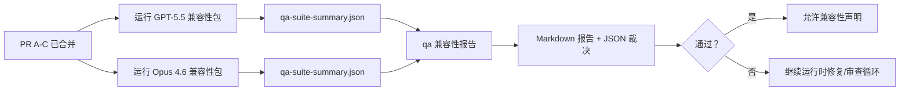

本文档说明如何在不丢失原始六合同架构的情况下，将 GPT-5.5 / Codex 兼容性计划作为四个合并单元进行审查。

## 合并单元

### PR A：严格代理执行

拥有：

- `executionContract`
- GPT-5 优先的同轮跟进
- `update_plan` 作为非终止进度跟踪
- 明确的阻塞状态而非仅计划的静默停止

不拥有：

- 验证/运行时失败分类
- 权限真实性
- 重放/续传重新设计
- 兼容性基准测试

### PR B：运行时真实性

拥有：

- Codex OAuth 范围正确性
- 类型化的提供商/运行时失败分类
- 真实的 `/elevated full` 可用性和阻塞原因

不拥有：

- 工具模式规范化
- 重放/活跃状态
- 基准测试门控

### PR C：执行正确性

拥有：

- 提供商拥有的 OpenAI/Codex 工具兼容性
- 无参数严格模式处理
- 重放无效显示
- 暂停、阻塞和放弃的长任务状态可见性

不拥有：

- 自选续传
- 提供商钩子之外的通用 Codex 方言行为
- 基准测试门控

### PR D：兼容性测试框架

拥有：

- 第一波 GPT-5.5 与 Opus 4.6 场景包
- 兼容性文档
- 兼容性报告和发布门控机制

不拥有：

- QA 实验室之外的运行时行为变更
- 测试框架内的验证/代理/DNS 模拟

## 映射回原始六个合同

| 原始合同              | 合并单元 |
| --------------------- | -------- |
| 提供商传输/验证正确性 | PR B     |
| 工具合同/模式兼容性   | PR C     |
| 同轮执行              | PR A     |
| 权限真实性            | PR B     |
| 重放/续传/活跃正确性  | PR C     |
| 基准测试/发布门控     | PR D     |

## 审查顺序

1. PR A
2. PR B
3. PR C
4. PR D

PR D 是证明层。它不应该成为延迟运行时正确性 PR 的原因。

## 需要关注的内容

### PR A

- GPT-5 运行执行或关闭失败，而不是停留在评论上
- `update_plan` 不再自身看起来像进度
- 行为保持 GPT-5 优先和嵌入式 Pi 范围

### PR B

- 验证/代理/运行时失败不再折叠为通用的"模型失败"处理
- `/elevated full` 只在实际可用时才被描述为可用
- 阻塞原因对模型和面向用户的运行时都可见

### PR C

- 严格的 OpenAI/Codex 工具注册行为可预测
- 无参数工具不会失败于严格模式检查
- 重放和压缩结果保留真实的活跃状态

### PR D

- 场景包可理解且可重现
- 包不仅包含只读流，还包含变更重放安全通道
- 报告对人工和自动化都可读
- 兼容性声明有证据支持，而非主观印象

PR D 的预期产物：

- 每次模型运行的 `qa-suite-report.md` / `qa-suite-summary.json`
- 带有汇总和场景级比较的 `qa-agentic-parity-report.md`
- 带有机器可读裁决的 `qa-agentic-parity-summary.json`

## 发布门控

在以下条件满足之前，不得声明 GPT-5.5 与 Opus 4.6 的兼容性或优越性：

- PR A、PR B 和 PR C 已合并
- PR D 干净地运行第一波兼容性包
- 运行时真实性回归测试套件保持绿色
- 兼容性报告显示没有假成功案例，停止行为没有回归

兼容性测试框架不是唯一的证据来源。在审查中保持这种划分明确：

- PR D 拥有基于场景的 GPT-5.5 与 Opus 4.6 比较
- PR B 确定性测试套件仍然拥有验证/代理/DNS 和完全访问真实性证据

## 快速维护者合并工作流

当你准备落地兼容性 PR 并想要一个可重复、低风险的序列时使用此工作流。

1. 合并前确认证据标准已满足：
   - 可重现的症状或失败测试
   - 在受影响代码中已验证的根本原因
   - 在涉及路径中的修复
   - 回归测试或明确的手动验证注记
2. 合并前进行分类/标记：
   - 当 PR 不应该落地时，应用任何 `r:*` 自动关闭标签
   - 保持合并候选没有未解决的阻塞线程
3. 在受影响的表面上本地验证：
   - `pnpm check:changed`
   - 当测试已更改或错误修复的信心依赖于测试覆盖时，使用 `pnpm test:changed`
4. 使用标准维护者流程落地（`/landpr` 流程），然后验证：
   - 链接的 issue 自动关闭行为
   - `main` 上的 CI 和合并后状态
5. 落地后，搜索相关开放 PR/issue 的重复，并仅带有规范引用关闭。

如果任何一个证据标准项缺失，请求更改而不是合并。

## 目标到证据映射

| 完成门控项                       | 主要负责人  | 审查产物                                                          |
| -------------------------------- | ----------- | ----------------------------------------------------------------- |
| 没有仅计划的停滞                 | PR A        | 严格代理运行时测试和 `approval-turn-tool-followthrough`           |
| 没有假进度或假工具完成           | PR A + PR D | 兼容性假成功计数加上场景级报告详情                                |
| 没有错误的 `/elevated full` 指导 | PR B        | 确定性运行时真实性测试套件                                        |
| 重放/活跃失败保持明确            | PR C + PR D | 生命周期/重放测试套件加上 `compaction-retry-mutating-tool`        |
| GPT-5.5 匹配或超越 Opus 4.6      | PR D        | `qa-agentic-parity-report.md` 和 `qa-agentic-parity-summary.json` |

## 审查者速查表：变更前后

| 变更前用户可见的问题                           | 变更后的审查信号                                          |
| ---------------------------------------------- | --------------------------------------------------------- |
| GPT-5.5 在规划后停止                           | PR A 显示执行或阻塞行为，而不是仅评论的完成               |
| 工具使用在严格的 OpenAI/Codex 模式中感觉很脆弱 | PR C 使工具注册和无参数调用可预测                         |
| `/elevated full` 提示有时会误导                | PR B 将指导与实际运行时能力和阻塞原因关联                 |
| 长任务可能消失在重放/压缩的歧义中              | PR C 发出明确的暂停、阻塞、放弃和重放无效状态             |
| 兼容性声明是主观的                             | PR D 在两个模型上产生带有相同场景覆盖的报告加上 JSON 裁决 |

## 相关链接

- [GPT-5.5 / Codex 代理兼容性](/help/gpt55-codex-agentic-parity)
