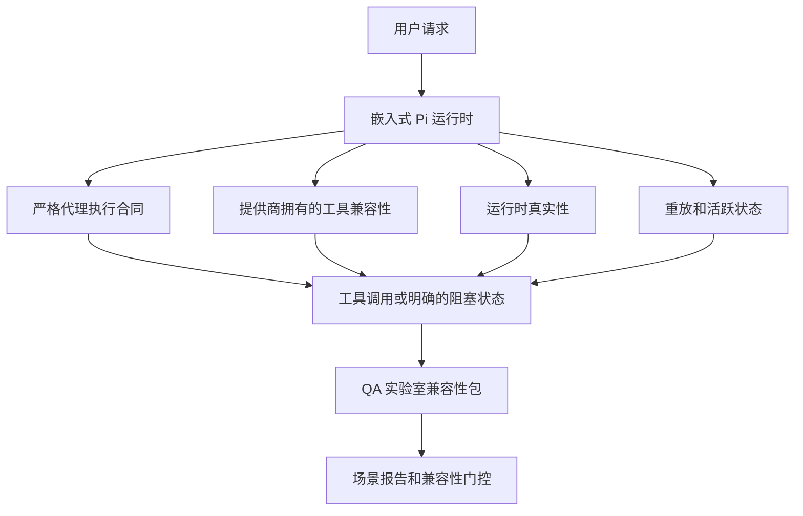

# OpenClaw 中的 GPT-5.5 / Codex 代理兼容性

OpenClaw 已经很好地支持使用工具的前沿模型，但 GPT-5.5 和 Codex 风格的模型在某些实际方面仍然表现不足：

- 它们可能在规划后停止，而不是执行工作
- 它们可能不正确地使用严格的 OpenAI/Codex 工具模式
- 即使完全访问不可能，它们也可能要求 `/elevated full`
- 在重放或压缩期间，它们可能丢失长时间运行的任务状态
- 与 Claude Opus 4.6 的兼容性声明基于主观印象而非可重复的场景

这个兼容性计划在四个可审查的切片中修复了这些差距。

## 变更内容

### PR A：严格代理执行

此切片为嵌入式 Pi GPT-5 运行添加了可选的 `strict-agentic` 执行合同。

启用后，OpenClaw 停止接受仅计划的轮次作为"足够好"的完成。如果模型只说明其打算做什么而没有实际使用工具或取得进展，OpenClaw 会用立即行动的转向重试，然后以明确的阻塞状态失败关闭，而不是静默地结束任务。

这最能改善 GPT-5.5 的体验，适用于：

- 简短的"好，执行"跟进
- 第一步明显的编码任务
- `update_plan` 应该是进度跟踪而非填充文本的流程

### PR B：运行时真实性

此切片使 OpenClaw 对两件事诚实：

- 提供商/运行时调用为何失败
- `/elevated full` 是否实际上可用

这意味着 GPT-5.5 获得更好的运行时信号，用于丢失范围、验证刷新失败、HTML 403 验证失败、代理问题、DNS 或超时失败以及被阻止的完全访问模式。模型不太可能幻觉出错误的补救措施，或继续要求运行时无法提供的权限模式。

### PR C：执行正确性

此切片改善了两种正确性：

- 提供商拥有的 OpenAI/Codex 工具模式兼容性
- 重放和长任务活跃性显示

工具兼容性工作减少了严格 OpenAI/Codex 工具注册的模式摩擦，特别是围绕无参数工具和严格对象根期望。重放/活跃性工作使长时间运行的任务更具可观察性，因此暂停、阻塞和放弃状态可见，而不是消失在通用失败文本中。

### PR D：兼容性测试框架

此切片添加了第一波 QA 实验室兼容性包，以便 GPT-5.5 和 Opus 4.6 可以通过相同的场景进行测试，并使用共享证据进行比较。

兼容性包是证明层。它本身不改变运行时行为。

拥有两个 `qa-suite-summary.json` 产物后，使用以下命令生成发布门控比较：

```bash
pnpm openclaw qa parity-report \
  --repo-root . \
  --candidate-summary .artifacts/qa-e2e/gpt55/qa-suite-summary.json \
  --baseline-summary .artifacts/qa-e2e/opus46/qa-suite-summary.json \
  --output-dir .artifacts/qa-e2e/parity
```

该命令写入：

- 人类可读的 Markdown 报告
- 机器可读的 JSON 裁决
- 明确的 `pass` / `fail` 门控结果

## 为什么这在实践中改善了 GPT-5.5

在这项工作之前，OpenClaw 上的 GPT-5.5 在实际编码会话中可能感觉不如 Opus 那么具有代理性，因为运行时容忍了对 GPT-5 风格模型特别有害的行为：

- 仅评论的轮次
- 工具的模式摩擦
- 模糊的权限反馈
- 静默的重放或压缩中断

目标不是让 GPT-5.5 模仿 Opus。目标是给 GPT-5.5 一个奖励真实进展、提供更清晰工具和权限语义、并将失败模式转变为明确的机器和人类可读状态的运行时合同。

这将用户体验从：

- "模型有一个好的计划但停止了"

改变为：

- "模型要么采取了行动，要么 OpenClaw 显示了无法行动的确切原因"

## GPT-5.5 用户的变更前后对比

| 此计划之前                                                             | PR A-D 之后                                              |
| ---------------------------------------------------------------------- | -------------------------------------------------------- |
| GPT-5.5 可能在合理的计划后停止，而没有采取下一个工具步骤               | PR A 将"仅计划"变为"立即行动或显示阻塞状态"              |
| 严格的工具模式可能以令人困惑的方式拒绝无参数或 OpenAI/Codex 形状的工具 | PR C 使提供商拥有的工具注册和调用更可预测                |
| `/elevated full` 指导在阻塞的运行时中可能含糊或错误                    | PR B 给 GPT-5.5 和用户真实的运行时和权限提示             |
| 重放或压缩失败可能感觉像任务静静地消失了                               | PR C 明确显示暂停、阻塞、放弃和重放无效的结果            |
| "GPT-5.5 感觉比 Opus 差"大多是主观的                                   | PR D 将其变成相同的场景包、相同的指标和硬性通过/失败门控 |

## 架构



## 发布流程


## 场景包

第一波兼容性包目前涵盖五个场景：

### `approval-turn-tool-followthrough`

检查模型在简短批准后是否停在"我会这样做"。它应该在同一轮中采取第一个具体行动。

### `model-switch-tool-continuity`

检查工具使用工作在模型/运行时切换边界之间是否保持连贯，而不是重置为评论或丢失执行上下文。

### `source-docs-discovery-report`

检查模型是否可以读取源代码和文档、综合发现，并以代理方式继续任务，而不是产生薄弱的摘要并过早停止。

### `image-understanding-attachment`

检查涉及附件的混合模式任务是否保持可操作性，不会折叠为模糊的叙述。

### `compaction-retry-mutating-tool`

检查具有真实变更写入的任务在运行压缩、重试或在压力下丢失回复状态时是否使重放不安全性保持明确，而不是静静地看起来重放安全。

## 场景矩阵

| 场景                               | 测试内容                    | 良好的 GPT-5.5 行为                            | 失败信号                                         |
| ---------------------------------- | --------------------------- | ---------------------------------------------- | ------------------------------------------------ |
| `approval-turn-tool-followthrough` | 计划后的简短批准轮次        | 立即开始第一个具体工具动作，而不是重述意图     | 仅计划的跟进、无工具活动或无真实阻塞的阻塞轮次   |
| `model-switch-tool-continuity`     | 工具使用下的运行时/模型切换 | 保持任务上下文并继续连贯行动                   | 重置为评论、丢失工具上下文或切换后停止           |
| `source-docs-discovery-report`     | 源代码读取 + 综合 + 行动    | 找到源代码、使用工具，并产生有用的报告而不停滞 | 薄弱摘要、缺少工具工作或不完整轮次停止           |
| `image-understanding-attachment`   | 附件驱动的代理工作          | 解释附件，将其与工具联系，并继续任务           | 模糊叙述、忽略附件或没有具体的下一步行动         |
| `compaction-retry-mutating-tool`   | 压缩压力下的变更工作        | 执行真实写入，并在副作用后保持重放不安全性明确 | 变更写入发生，但重放安全性被暗示、缺失或相互矛盾 |

## 发布门控

只有当合并的运行时同时通过兼容性包和运行时真实性回归时，GPT-5.5 才能被认为与 Opus 4.6 达到兼容性或更好。

必需的结果：

- 当下一个工具动作明确时，没有仅计划的停滞
- 没有没有真实执行的假完成
- 没有不正确的 `/elevated full` 指导
- 没有静默的重放或压缩放弃
- 至少与商定的 Opus 4.6 基准一样强的兼容性包指标

对于第一波测试框架，门控比较：

- 完成率
- 非预期停止率
- 有效工具调用率
- 假成功计数

兼容性证据被有意分为两层：

- PR D 使用 QA 实验室证明相同场景下 GPT-5.5 与 Opus 4.6 的行为
- PR B 确定性测试套件在测试框架之外证明验证、代理、DNS 和 `/elevated full` 真实性

## 目标到证据矩阵

| 完成门控项                                   | 负责 PR     | 证据来源                                                          | 通过信号                                               |
| -------------------------------------------- | ----------- | ----------------------------------------------------------------- | ------------------------------------------------------ |
| GPT-5.5 不再在规划后停滞                     | PR A        | `approval-turn-tool-followthrough` 加上 PR A 运行时测试套件       | 批准轮次触发真实工作或明确的阻塞状态                   |
| GPT-5.5 不再假造进度或假工具完成             | PR A + PR D | 兼容性报告场景结果和假成功计数                                    | 没有可疑的通过结果，没有仅评论的完成                   |
| GPT-5.5 不再给出错误的 `/elevated full` 指导 | PR B        | 确定性真实性测试套件                                              | 阻塞原因和完全访问提示保持运行时准确                   |
| 重放/活跃失败保持明确                        | PR C + PR D | PR C 生命周期/重放测试套件加上 `compaction-retry-mutating-tool`   | 变更工作使重放不安全性明确，而不是静静地消失           |
| GPT-5.5 在商定的指标上匹配或超越 Opus 4.6    | PR D        | `qa-agentic-parity-report.md` 和 `qa-agentic-parity-summary.json` | 相同的场景覆盖，完成、停止行为或有效工具使用上没有回归 |

## 如何阅读兼容性裁决

使用 `qa-agentic-parity-summary.json` 中的裁决作为第一波兼容性包的最终机器可读决定。

- `pass` 意味着 GPT-5.5 覆盖了与 Opus 4.6 相同的场景，并且在商定的汇总指标上没有回归。
- `fail` 意味着至少一个硬性门控触发：更弱的完成、更差的非预期停止、更弱的有效工具使用、任何假成功案例或不匹配的场景覆盖。
- "共享/基础 CI 问题"本身不是兼容性结果。如果 PR D 之外的 CI 噪音阻塞了运行，裁决应该等待干净的合并运行时执行，而不是从分支时代的日志中推断。
- 验证、代理、DNS 和 `/elevated full` 真实性仍然来自 PR B 的确定性测试套件，因此最终发布声明需要两者：通过的 PR D 兼容性裁决和绿色的 PR B 真实性覆盖。

## 谁应该启用 `strict-agentic`

在以下情况下使用 `strict-agentic`：

- 当下一步明显时，代理应该立即行动
- GPT-5.5 或 Codex 系列模型是主要运行时
- 你更喜欢明确的阻塞状态而非"有帮助的"仅摘要回复

在以下情况下保持默认合同：

- 你想要现有的更宽松的行为
- 你没有使用 GPT-5 系列模型
- 你在测试提示而不是运行时强制执行

## 相关链接

- [GPT-5.5 / Codex 兼容性维护者注意事项](/help/gpt55-codex-agentic-parity-maintainers)
