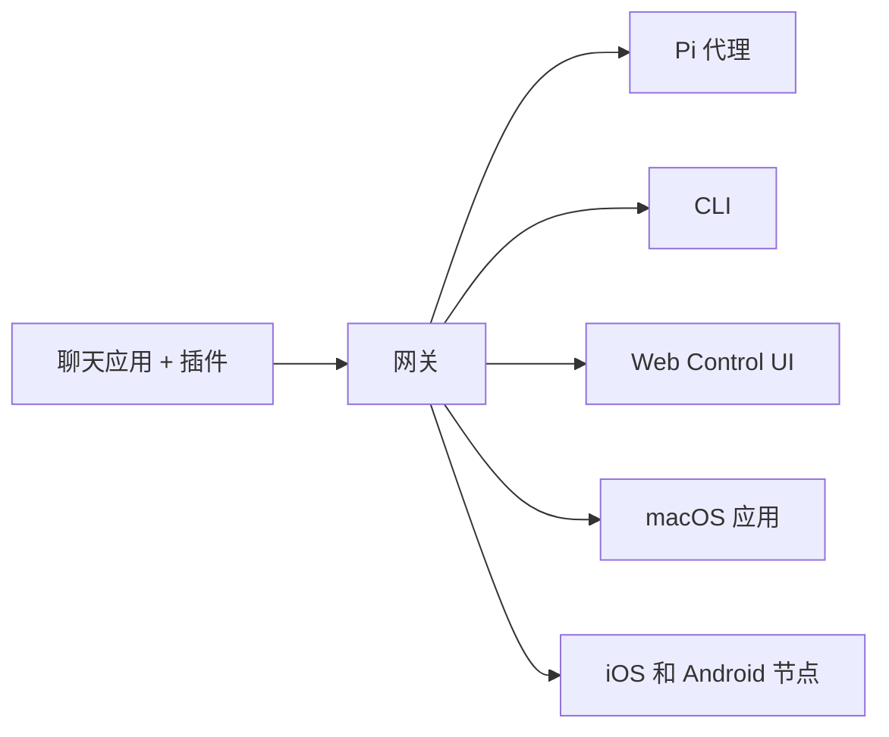

# OpenClaw 🦞

<p align="center">
    
    
</p>

> _"EXFOLIATE! EXFOLIATE!"_ — 某只太空龙虾，大概是

<p align="center">
  <strong>适用于任何操作系统的 AI 代理网关，支持 Discord、Google Chat、iMessage、Matrix、Microsoft Teams、Signal、Slack、Telegram、WhatsApp、Zalo 等更多平台。</strong><br />
  发送一条消息，即可从你的口袋里获得代理响应。通过内置频道、捆绑频道插件、WebChat 和移动节点运行单个网关。
</p>

<Columns>
  <Card title="快速开始" href="/start/getting-started" icon="rocket">
    安装 OpenClaw 并在几分钟内启动网关。
  </Card>
  <Card title="运行引导程序" href="/start/wizard" icon="sparkles">
    使用 `openclaw onboard` 和配对流程进行引导设置。
  </Card>
  <Card title="打开 Control UI" href="/web/control-ui" icon="layout-dashboard">
    启动浏览器仪表盘进行聊天、配置和会话管理。
  </Card>
</Columns>

## 什么是 OpenClaw？

OpenClaw 是一个**自托管网关**，可将你喜爱的聊天应用和频道界面——内置频道加上捆绑或外部频道插件，例如 Discord、Google Chat、iMessage、Matrix、Microsoft Teams、Signal、Slack、Telegram、WhatsApp、Zalo 等——连接到 Pi 等 AI 编程代理。你在自己的机器（或服务器）上运行单个网关进程，它成为你的消息应用和始终可用的 AI 助手之间的桥梁。

**适合谁使用？** 开发者和高级用户，他们希望拥有可以从任何地方发送消息的个人 AI 助手——无需放弃对数据的控制权，也无需依赖托管服务。

**有何不同？**

- **自托管**：在你的硬件上运行，遵循你的规则
- **多频道**：一个网关同时服务内置频道加上捆绑或外部频道插件
- **代理原生**：为具有工具使用、会话、内存和多代理路由的编程代理构建
- **开源**：MIT 许可，社区驱动

**需要什么？** Node 24（推荐），或 Node 22 LTS（`22.14+`）以兼容，来自所选提供商的 API 密钥，以及 5 分钟时间。为了最佳质量和安全性，请使用可用的最强最新一代模型。

## 工作原理



网关是会话、路由和频道连接的单一可信来源。

## 核心功能

<Columns>
  <Card title="多频道网关" icon="network" href="/channels">
    通过单个网关进程支持 Discord、iMessage、Signal、Slack、Telegram、WhatsApp、WebChat 等。
  </Card>
  <Card title="插件频道" icon="plug" href="/tools/plugin">
    捆绑插件在常规当前版本中添加 Matrix、Nostr、Twitch、Zalo 等。
  </Card>
  <Card title="多代理路由" icon="route" href="/concepts/multi-agent">
    每个代理、工作区或发送者的隔离会话。
  </Card>
  <Card title="媒体支持" icon="image" href="/nodes/images">
    发送和接收图片、音频和文档。
  </Card>
  <Card title="Web Control UI" icon="monitor" href="/web/control-ui">
    用于聊天、配置、会话和节点的浏览器仪表盘。
  </Card>
  <Card title="移动节点" icon="smartphone" href="/nodes">
    配对 iOS 和 Android 节点以实现 Canvas、摄像头和语音工作流。
  </Card>
</Columns>

## 快速入门

<Steps>
  <Step title="安装 OpenClaw">
    ```bash
    npm install -g openclaw@latest
    ```
  </Step>
  <Step title="引导并安装服务">
    ```bash
    openclaw onboard --install-daemon
    ```
  </Step>
  <Step title="开始聊天">
    在浏览器中打开 Control UI 并发送消息：

    ```bash
    openclaw dashboard
    ```

    或连接一个频道（[Telegram](/channels/telegram) 最快），从手机开始聊天。

  </Step>
</Steps>

需要完整的安装和开发设置？请参阅[快速开始](/start/getting-started)。

## 仪表盘

网关启动后打开浏览器 Control UI。

- 本地默认地址：[http://127.0.0.1:18789/](http://127.0.0.1:18789/)
- 远程访问：[Web 界面](/web)和 [Tailscale](/gateway/tailscale)

<p align="center">
  
</p>

## 配置（可选）

配置文件位于 `~/.openclaw/openclaw.json`。

- 如果**什么都不做**，OpenClaw 使用 RPC 模式下的捆绑 Pi 二进制文件，每个发送者一个会话。
- 如果你想加以限制，从 `channels.whatsapp.allowFrom` 开始，以及（对于群组）提及规则。

示例：

```json5
{
  channels: {
    whatsapp: {
      allowFrom: ["+15555550123"],
      groups: { "*": { requireMention: true } },
    },
  },
  messages: { groupChat: { mentionPatterns: ["@openclaw"] } },
}
```

## 从这里开始

<Columns>
  <Card title="文档中心" href="/start/hubs" icon="book-open">
    按用例组织的所有文档和指南。
  </Card>
  <Card title="配置" href="/gateway/configuration" icon="settings">
    核心网关设置、令牌和提供商配置。
  </Card>
  <Card title="远程访问" href="/gateway/remote" icon="globe">
    SSH 和 tailnet 访问模式。
  </Card>
  <Card title="频道" href="/channels/telegram" icon="message-square">
    Feishu、Microsoft Teams、WhatsApp、Telegram、Discord 等频道的特定设置。
  </Card>
  <Card title="节点" href="/nodes" icon="smartphone">
    具有配对、Canvas、摄像头和设备操作的 iOS 和 Android 节点。
  </Card>
  <Card title="帮助" href="/help" icon="life-buoy">
    常见修复和故障排除入口。
  </Card>
</Columns>

## 了解更多

<Columns>
  <Card title="完整功能列表" href="/concepts/features" icon="list">
    完整的频道、路由和媒体功能。
  </Card>
  <Card title="多代理路由" href="/concepts/multi-agent" icon="route">
    工作区隔离和每代理会话。
  </Card>
  <Card title="安全性" href="/gateway/security" icon="shield">
    令牌、允许列表和安全控制。
  </Card>
  <Card title="故障排除" href="/gateway/troubleshooting" icon="wrench">
    网关诊断和常见错误。
  </Card>
  <Card title="关于和致谢" href="/reference/credits" icon="info">
    项目起源、贡献者和许可证。
  </Card>
</Columns>
