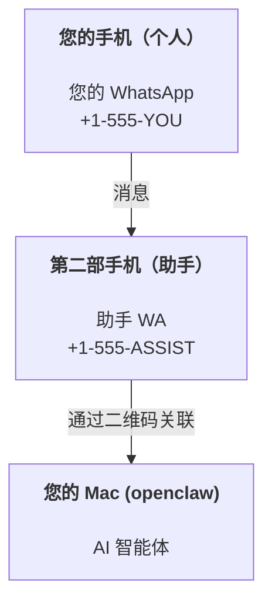

# 使用 OpenClaw 构建个人助手

OpenClaw 是一个自托管的 gateway，可将 Discord、Google Chat、iMessage、Matrix、Microsoft Teams、Signal、Slack、Telegram、WhatsApp、Zalo 等连接到 AI 智能体。本指南涵盖了"个人助手"设置：一个专用的 WhatsApp 号码，表现得像您的全天候 AI 助手。

## ⚠️ 安全第一

您正在将智能体置于以下位置：

- 在您的机器上运行命令（取决于您的工具策略）
- 在您的工作区读写文件
- 通过 WhatsApp/Telegram/Discord/Mattermost 和其他捆绑渠道发回消息

保守起步：

- 始终设置 `channels.whatsapp.allowFrom`（永远不要在您的个人 Mac 上开放给全世界）。
- 为助手使用专用的 WhatsApp 号码。
- 心跳现在默认每 30 分钟一次。在您信任设置之前，通过设置 `agents.defaults.heartbeat.every: "0m"` 来禁用它。

## 前提条件

- OpenClaw 已安装并已入门——如果您还没有做到这一点，请参见[入门](/start/getting-started)
- 为助手准备一个第二个电话号码（SIM/eSIM/预付费）

## 双手机设置（推荐）

您需要这样的配置：



如果您将个人 WhatsApp 关联到 OpenClaw，每条发给您的消息都会成为"智能体输入"。这很少是您想要的。

## 5 分钟快速开始

1. 配对 WhatsApp Web（显示二维码；用助手手机扫描）：

```bash
openclaw channels login
```

2. 启动 Gateway（保持运行）：

```bash
openclaw gateway --port 18789
```

3. 将最简配置放入 `~/.openclaw/openclaw.json`：

```json5
{
  gateway: { mode: "local" },
  channels: { whatsapp: { allowFrom: ["+15555550123"] } },
}
```

现在从您的允许列表手机向助手号码发送消息。

当入门完成后，OpenClaw 会自动打开仪表盘并打印一个干净的（非令牌化的）链接。如果仪表盘提示认证，请将配置的共享密钥粘贴到 Control UI 设置中。入门默认使用令牌（`gateway.auth.token`），但如果您将 `gateway.auth.mode` 切换到 `password`，密码认证也有效。稍后重新打开：`openclaw dashboard`。

## 为智能体提供工作区（AGENTS）

OpenClaw 从其工作区目录读取操作指令和"记忆"。

默认情况下，OpenClaw 使用 `~/.openclaw/workspace` 作为智能体工作区，并会在设置/首次智能体运行时自动创建它（以及启动器 `AGENTS.md`、`SOUL.md`、`TOOLS.md`、`IDENTITY.md`、`USER.md`、`HEARTBEAT.md`）。`BOOTSTRAP.md` 仅在工作区全新时才创建（删除后不应再出现）。`MEMORY.md` 是可选的（不会自动创建）；存在时，它会在正常会话中加载。子智能体会话只注入 `AGENTS.md` 和 `TOOLS.md`。

<Tip>
将此文件夹视为 OpenClaw 的记忆，并将其设为 git 仓库（最好是私有的），以便备份您的 `AGENTS.md` 和记忆文件。如果安装了 git，全新的工作区会自动初始化。
</Tip>

```bash
openclaw setup
```

完整工作区布局 + 备份指南：[智能体工作区](/concepts/agent-workspace)
记忆工作流：[记忆](/concepts/memory)

可选：使用 `agents.defaults.workspace` 选择不同的工作区（支持 `~`）。

```json5
{
  agents: {
    defaults: {
      workspace: "~/.openclaw/workspace",
    },
  },
}
```

如果您已经从仓库提供了自己的工作区文件，您可以完全禁用引导文件创建：

```json5
{
  agents: {
    defaults: {
      skipBootstrap: true,
    },
  },
}
```

## 将其配置为"助手"的配置

OpenClaw 默认有良好的助手设置，但您通常需要调整：

- [`SOUL.md`](/concepts/soul) 中的角色/指令
- 思考默认值（如果需要）
- 心跳（一旦信任它）

示例：

```json5
{
  logging: { level: "info" },
  agent: {
    model: "anthropic/claude-opus-4-6",
    workspace: "~/.openclaw/workspace",
    thinkingDefault: "high",
    timeoutSeconds: 1800,
    // 从 0 开始；稍后启用。
    heartbeat: { every: "0m" },
  },
  channels: {
    whatsapp: {
      allowFrom: ["+15555550123"],
      groups: {
        "*": { requireMention: true },
      },
    },
  },
  routing: {
    groupChat: {
      mentionPatterns: ["@openclaw", "openclaw"],
    },
  },
  session: {
    scope: "per-sender",
    resetTriggers: ["/new", "/reset"],
    reset: {
      mode: "daily",
      atHour: 4,
      idleMinutes: 10080,
    },
  },
}
```

## 会话和记忆

- 会话文件：`~/.openclaw/agents/<agentId>/sessions/{{SessionId}}.jsonl`
- 会话元数据（令牌使用、最后路由等）：`~/.openclaw/agents/<agentId>/sessions/sessions.json`（旧版：`~/.openclaw/sessions/sessions.json`）
- `/new` 或 `/reset` 为该聊天启动新会话（可通过 `resetTriggers` 配置）。如果单独发送，OpenClaw 会确认重置而不调用模型。
- `/compact [instructions]` 压缩会话上下文并报告剩余的上下文预算。

## 心跳（主动模式）

默认情况下，OpenClaw 每 30 分钟运行一次心跳，提示为：
`如果存在则读取 HEARTBEAT.md（工作区上下文）。严格遵守。不要从之前的聊天中推断或重复旧任务。如果没有需要关注的内容，回复 HEARTBEAT_OK。`
设置 `agents.defaults.heartbeat.every: "0m"` 以禁用。

- 如果 `HEARTBEAT.md` 存在但实际上为空（只有空行和像 `# 标题` 这样的 Markdown 标题），OpenClaw 跳过心跳运行以节省 API 调用。
- 如果文件缺失，心跳仍然运行，模型决定做什么。
- 如果智能体回复 `HEARTBEAT_OK`（可选带有简短填充；参见 `agents.defaults.heartbeat.ackMaxChars`），OpenClaw 会为该心跳抑制出站传递。
- 默认情况下，允许心跳传递到 DM 式 `user:<id>` 目标。设置 `agents.defaults.heartbeat.directPolicy: "block"` 可在保持心跳运行活跃的同时抑制直接目标传递。
- 心跳运行完整的智能体轮次——间隔越短，消耗的令牌越多。

```json5
{
  agent: {
    heartbeat: { every: "30m" },
  },
}
```

## 媒体输入输出

入站附件（图片/音频/文档）可以通过模板呈现给您的命令：

- `{{MediaPath}}`（本地临时文件路径）
- `{{MediaUrl}}`（伪 URL）
- `{{Transcript}}`（如果启用了音频转录）

智能体的出站附件：在其自己的行上包含 `MEDIA:<path-or-url>`（无空格）。示例：

```
这是截图。
MEDIA:https://example.com/screenshot.png
```

OpenClaw 提取这些并将其作为媒体与文本一起发送。

本地路径行为遵循与智能体相同的文件读取信任模型：

- 如果 `tools.fs.workspaceOnly` 为 `true`，出站 `MEDIA:` 本地路径限于 OpenClaw 临时根目录、媒体缓存、智能体工作区路径和沙箱生成的文件。
- 如果 `tools.fs.workspaceOnly` 为 `false`，出站 `MEDIA:` 可以使用智能体已被允许读取的宿主机本地文件。
- 本地路径可以是绝对路径、工作区相对路径或带 `~/` 的家目录相对路径。
- 宿主机本地发送仍然只允许媒体和安全文档类型（图片、音频、视频、PDF 和 Office 文档）。纯文本和类似秘密的文件不被视为可发送的媒体。

这意味着工作区外生成的图片/文件现在可以在您的 fs 策略已允许这些读取时发送，而无需重新开放任意宿主机文本附件渗出。

## 运营检查清单

```bash
openclaw status          # 本地状态（凭据、会话、排队事件）
openclaw status --all    # 完整诊断（只读，可粘贴）
openclaw status --deep   # 向 gateway 请求实时健康探测，在支持时包含渠道探测
openclaw health --json   # gateway 健康快照（WS；默认可以返回新鲜的缓存快照）
```

日志位于 `/tmp/openclaw/` 下（默认：`openclaw-YYYY-MM-DD.log`）。

## 下一步

- WebChat：[WebChat](/web/webchat)
- Gateway 运营：[Gateway 运行手册](/gateway)
- 定时任务 + 唤醒：[定时任务](/automation/cron-jobs)
- macOS 菜单栏伴侣：[OpenClaw macOS 应用](/platforms/macos)
- iOS 节点应用：[iOS 应用](/platforms/ios)
- Android 节点应用：[Android 应用](/platforms/android)
- Windows 状态：[Windows（WSL2）](/platforms/windows)
- Linux 状态：[Linux 应用](/platforms/linux)
- 安全：[安全](/gateway/security)

## 相关

- [入门](/start/getting-started)
- [设置](/start/setup)
- [渠道概述](/channels)
